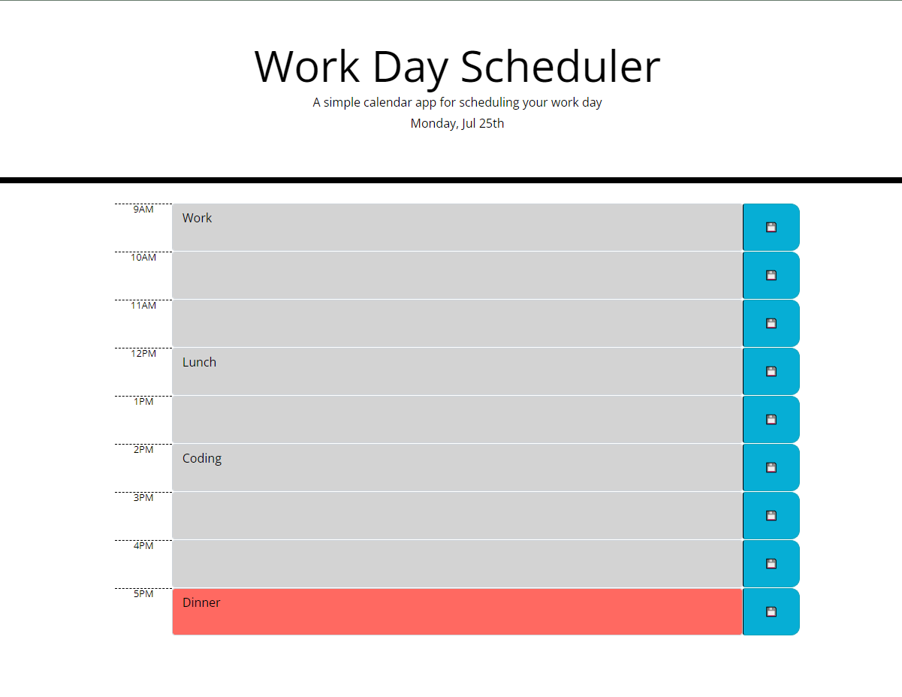

# Day Planner

## Description
Using Moment.JS and JQuery - create a day planner

## Functionality
- Title includes date
- Used bootstrap and CSS classes to style the page
- Colors change based on time of day
- Colors and date update every minute
- Add event to calendar with a working save button to local storage
- On refresh, page loads local storage data and posts to correct time slot

## Links
-[Github code link](https://github.com/heintze11/Work-Day-Scheduler)

-[Github pages link](https://heintze11.github.io/Work-Day-Scheduler/)

## Screenshot

